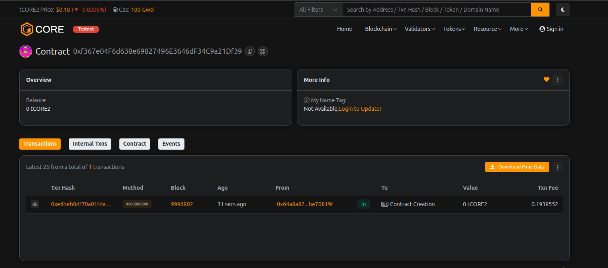

# MetaVault Protocol

## Project Description

MetaVault Protocol is a decentralized vault management system built on the Ethereum blockchain. It provides users with a secure and transparent way to store, manage, and control their crypto assets through individual vaults. Each user can create multiple vaults, deposit funds, withdraw as needed, and maintain complete control over their assets without intermediaries.

The protocol leverages smart contract technology to ensure trustless operations, where all transactions are transparent, immutable, and secured by the blockchain. MetaVault Protocol eliminates the need for traditional custodial services by giving users full sovereignty over their digital assets.

## Project Vision

Our vision is to revolutionize digital asset management by creating a decentralized, secure, and user-friendly vault system that empowers individuals with complete control over their crypto holdings. We aim to:

- **Democratize Access**: Provide everyone with access to sophisticated vault management tools traditionally available only to institutional investors
- **Enhance Security**: Eliminate single points of failure through decentralization and smart contract automation
- **Promote Financial Sovereignty**: Enable users to be their own bank without relying on centralized institutions
- **Build Trust**: Create a transparent system where all operations are verifiable on-chain
- **Foster Innovation**: Establish a foundation for advanced DeFi functionalities and cross-chain asset management

## Key Features

### 1. **Multi-Vault System**
- Users can create unlimited individual vaults for better asset organization
- Each vault maintains its own balance and transaction history
- Separate vaults for different investment strategies or purposes

### 2. **Core Vault Operations**
- **Create Vault**: Initialize new vaults with initial deposits
- **Deposit Funds**: Add funds to existing vaults at any time
- **Withdraw Funds**: Withdraw partial or full amounts from vaults
- **View Details**: Check vault balance, creation time, and status
- **Close Vault**: Deactivate vaults and withdraw all remaining funds

### 3. **Transparent Tracking**
- Real-time balance monitoring for individual vaults and total holdings
- Complete transaction history through blockchain events
- Contract-wide statistics including total deposits and vault count

### 4. **Security Features**
- Ownership verification for all vault operations
- Protected withdrawal mechanisms with balance checks
- Emergency withdrawal function for contract owner
- Modifier-based access control

### 5. **User-Friendly Design**
- Simple and intuitive function interfaces
- Comprehensive event logging for easy tracking
- Gas-optimized operations for cost efficiency

## Future Scope

### Phase 1: Enhanced Functionality (Q1-Q2 2026)
- **Time-Locked Vaults**: Implement vesting schedules and time-based withdrawals
- **Multi-Signature Support**: Enable shared vault management with multiple owners
- **Yield Generation**: Integrate with DeFi protocols for passive income on deposited assets
- **NFT Support**: Extend vault capabilities to store and manage NFTs

### Phase 2: Advanced Features (Q3-Q4 2026)
- **Cross-Chain Integration**: Enable vault management across multiple blockchains
- **Automated Strategies**: Implement smart rebalancing and investment strategies
- **Governance Token**: Launch native token for protocol governance and rewards
- **Insurance Layer**: Add optional insurance for vault protection

### Phase 3: Ecosystem Expansion (2027)
- **Mobile Application**: Develop dedicated iOS and Android apps
- **Social Recovery**: Implement decentralized account recovery mechanisms
- **API Services**: Provide developer APIs for third-party integrations
- **Institutional Features**: Add compliance tools and reporting for institutional users

### Phase 4: Innovation & Scaling (2028+)
- **AI-Powered Analytics**: Integrate AI for portfolio optimization and risk assessment
- **Layer 2 Deployment**: Deploy on multiple L2 solutions for reduced fees
- **Metaverse Integration**: Enable vault access within virtual worlds
- **Regulatory Compliance**: Develop KYC/AML modules for regulated markets

---

## Technical Specifications

**Solidity Version**: ^0.8.19  
**License**: MIT  
**Network Compatibility**: Ethereum and EVM-compatible chains

## Getting Started

### Prerequisites
- Node.js v16+
- Hardhat or Truffle
- MetaMask or compatible Web3 wallet

### Installation
```bash
npm install
```

### Deployment
```bash
npx hardhat compile
npx hardhat deploy --network <network-name>
```

### Testing
```bash
npx hardhat test
```

## Contract Address
*To be deployed*

## Security
This contract has not been audited. Please use at your own risk. We recommend thorough testing and professional audit before mainnet deployment.

## Contributing
We welcome contributions! Please see our contributing guidelines for more details.

## License
MIT License - see LICENSE file for details

## Contact
- Website: [Coming Soon]
- Twitter: [Coming Soon]
- Discord: [Coming Soon]

---

**Disclaimer**: MetaVault Protocol is experimental software. Users should exercise caution and never deposit more than they can afford to lose.

---

## Contract Details:

Transaction id: 0xf367e04F6d638e69827496E3646dF34C9a21Df39
